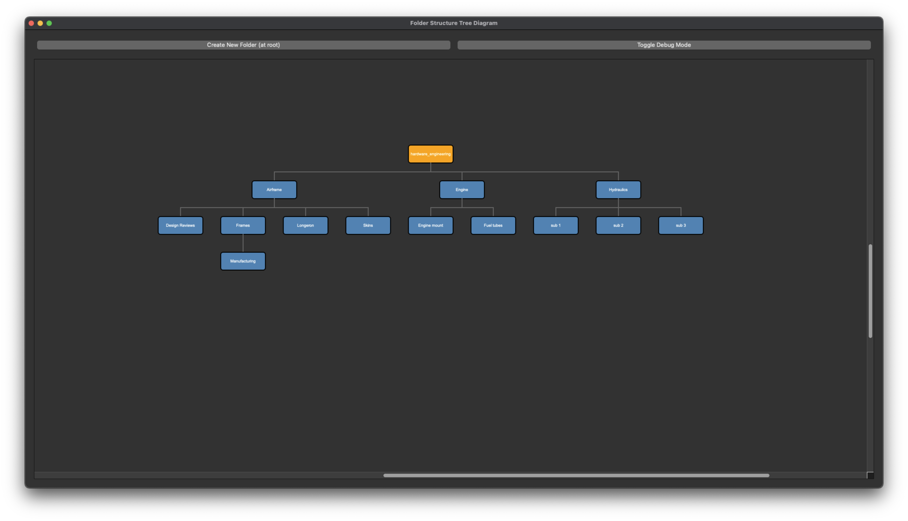

# Folder Structure Tree Diagram

A powerful and intuitive tool for visualizing hierarchical folder structures, designed for professionals who work with complex project organizations containing nested information.

## 🎯 Purpose

This tool addresses the challenge of understanding complex folder hierarchies by providing an interactive, visual representation that makes it easy to navigate and understand project structures. Whether you're working with software projects, research data, engineering documentation, or any hierarchical information system, this tool helps you quickly grasp the organization and relationships between different components.

## 📸 Screenshot



*The tree diagram shows a hierarchical folder structure with orange-highlighted focused nodes, orthogonal connections between parent and child folders, and an intuitive layout that prevents overlaps.*

## ✨ Key Features

### 🖱️ **Intuitive Navigation**
- **Left-click**: Open folder in native file manager (Finder on Mac, Explorer on Windows)
- **Right-click**: Context menu with folder management options
- **Arrow keys**: Navigate through the tree structure with spatial awareness
- **Ctrl+N**: Create new folders under the currently focused node

### 🎨 **Visual Design**
- **Tree Diagram**: Hierarchical visualization with orthogonal connections
- **Color Coding**: 
  - Orange: Focused/selected nodes
  - Steel Blue: Normal nodes
  - Red: Overlapping nodes (debug mode)
- **Smart Layout**: Automatic positioning to prevent overlaps
- **Infinite Canvas**: Large scrollable workspace for complex structures

### 🔧 **Folder Management**
- **Create Subfolders**: Add new directories at any level
- **Rename Folders**: Modify folder names with validation
- **Delete Folders**: Remove directories with confirmation
- **Properties View**: Detailed information about folder contents and metadata

### ⌨️ **Keyboard Shortcuts**
- **↑/↓**: Navigate vertically through nodes
- **←/→**: Navigate horizontally through nodes
- **Ctrl+N**: Create new folder under focused node
- **Click**: Set focus and open native file manager

## 🚀 Getting Started

### Prerequisites
- Python 3.6+
- PyQt5

### Installation
```bash
# Clone the repository
git clone <repository-url>
cd hardware_engineering

# Install dependencies
pip install PyQt5

# Run the application
python folder_tree_diagram.py
```

### Usage
1. **Launch the application**: `python folder_tree_diagram.py`
2. **Navigate**: Use arrow keys or mouse to explore the tree
3. **Interact**: 
   - Left-click to open folders in native file manager
   - Right-click for context menu options
   - Use Ctrl+N to create new folders
4. **Explore**: The tree automatically adjusts to show your folder structure

## 🎛️ Controls

### Mouse Controls
- **Left-click on node**: Opens folder in native file manager
- **Right-click on node**: Shows context menu with options
- **Click and drag**: Scroll around the tree diagram

### Keyboard Controls
- **Arrow Keys**: Navigate through nodes with spatial awareness
- **Ctrl+N**: Create new folder under focused node
- **Tab**: Focus on the tree diagram widget

### Context Menu Options
- **Create Subfolder**: Add new directory under selected node
- **Rename Folder**: Change folder name (non-root nodes only)
- **Delete Folder**: Remove directory and contents (non-root nodes only)
- **Properties**: View detailed folder information

## 🏗️ Architecture

### Core Components
- **TreeDiagram**: Main visualization widget with custom drawing
- **TreeNode**: Data structure representing folders and their relationships
- **ScrollableTreeDiagram**: Wrapper with scroll area and controls
- **Navigation System**: Spatial-aware keyboard navigation
- **File Manager Integration**: Cross-platform native folder opening

### Technical Features
- **Spatial Navigation**: Arrow keys follow visual direction on screen
- **Auto-scroll**: Focused nodes are automatically kept visible
- **Overlap Resolution**: Smart positioning prevents node collisions
- **Cross-platform**: Works on macOS, Windows, and Linux
- **Real-time Updates**: Tree rebuilds when folders are modified

## 🎯 Use Cases

### Software Development
- Visualize complex codebase structures
- Navigate through nested module hierarchies
- Understand project organization patterns

### Research & Data Science
- Explore large datasets with hierarchical organization
- Navigate through experiment results and data collections
- Understand research project structure

### Engineering & Documentation
- Visualize technical documentation hierarchies
- Navigate through design files and specifications
- Understand project component relationships

### Content Management
- Explore media libraries and asset organization
- Navigate through nested content structures
- Understand information architecture

## 🔧 Customization

### Changing Root Directory
Modify the `root_path` variable in the main section:
```python
root_path = '/path/to/your/project'  # Change this to any path
```

### Debug Mode
Toggle debug mode to see overlapping nodes highlighted in red:
- Click the "Toggle Debug Mode" button
- Useful for understanding layout algorithms

### Visual Customization
The tool uses a clean, professional color scheme:
- Orange highlights for focused/selected nodes
- Steel blue for normal nodes
- Gray connections between nodes
- Black text on white background

## 🛠️ Development

### Project Structure
```
hardware_engineering/
├── folder_tree_diagram.py    # Main application
├── create_test_structure.py  # Test data generator
├── folder_tree_pyqt.py      # Alternative QTreeView implementation
├── visualize_tree.py        # Console-based tree visualization
└── README.md               # This file
```

### Key Algorithms
- **Spatial Navigation**: Distance-based node selection for arrow keys
- **Overlap Resolution**: Multi-level positioning to prevent collisions
- **Tree Building**: Recursive folder structure parsing
- **Route Calculation**: Orthogonal connection routing between nodes

## 🤝 Contributing

This project is designed to be extensible. Key areas for enhancement:
- Additional file manager integrations
- Custom visual themes
- Export functionality (PNG, SVG, etc.)
- Search and filter capabilities
- Integration with version control systems

## 📄 License

This project is open source and available under the MIT License.

## 🎉 Acknowledgments

Built with PyQt5 for cross-platform GUI functionality and designed for professionals who need intuitive tools for understanding complex hierarchical information structures. 